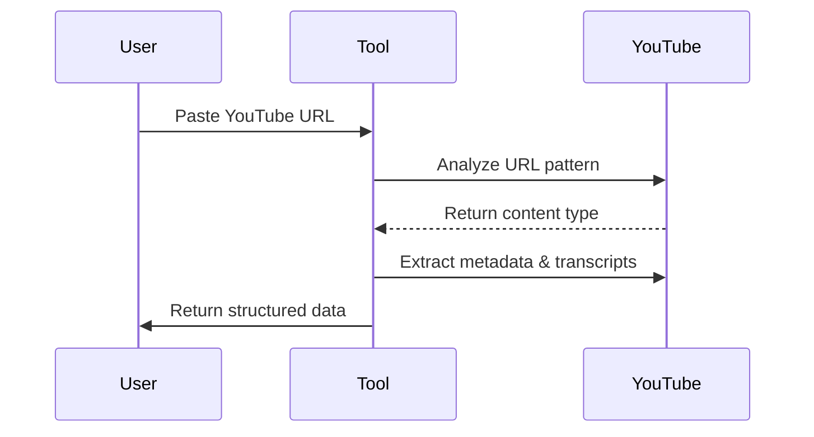

# 🎬 YouTube Transcript Smart Extractor Pro

[YouTube Transcript Pro](https://apify.com/dz_omar/youtube-transcript-pro) Extracts transcripts and metadata from ALL YouTube content: Videos, Shorts, Live streams, Podcasts, Courses, and full Channels. Processes playlists and batch requests. Proxy required. Perfect for researchers, marketers, and content creators.
## 🚀 The Intelligent Way to Extract YouTube Content

**Extract comprehensive transcripts with rich metadata in seconds** - our advanced tool automatically detects and processes any YouTube URL type. Simply paste a link and get perfectly structured results.


## ✨ What Makes This Actor Unique

Unlike other transcript extractors on the platform, our actor offers:

- **Automatic content type detection** - Intelligently identifies videos, shorts, playlists, channels, courses, and live streams
- **URL pattern recognition** - Understands what you want based on the URL structure
- **Ultra-fast processing** - Extract 100 video transcripts in under 10 minutes
- **Comprehensive metadata** - Get timestamps, views, publication dates, and more
- **Multi-language support** - Works with all languages available in YouTube captions

## 🎯 Key Features

| Feature | Benefit |
|---------|---------|
| 🧠 **Smart URL Detection** | Automatically identifies the content type from URL patterns |
| ⚡ **High-Speed Processing** | Process 100 videos in approximately 10 minutes |
| 🌐 **Universal Compatibility** | Works with videos, shorts, playlists, channels, courses, live streams |
| 📊 **Rich Metadata** | Captures comprehensive video information alongside transcripts |
| 🔍 **Precision Extraction** | Accurately retrieves timestamps with corresponding text segments |
| 🛡️ **Reliable Performance** | Built-in retry mechanisms and configurable delay settings |

## 🔍 How It Works (3 Simple Steps)

1. **Paste** any YouTube URL (channel, playlist, video, etc.)
2. **Set** your preferences (optional)
3. **Get** perfect structured data in JSON/CSV



## 🔧 Input Configuration

### Basic Usage
Simply provide one or more YouTube URLs:

```json
{
  "rawYouTubeUrls": [
    "https://www.youtube.com/@nesoacademy/shorts",
    "https://www.youtube.com/watch?v=qUdSpbimHDQ",
    "https://www.youtube.com/playlist?list=PLBlnK6fEyqRhoF3cPp0mgOZPuXeu84nAd"
  ],
  "maxResults": 50
}
```

### Advanced Configuration
Fine-tune the extraction process:

```json
{
  "rawYouTubeUrls": [
    "https://www.youtube.com/@nesoacademy/courses"
  ],
  "maxResults": 100,
  "MAX_RETRIES": 5,
  "BASE_DELAY_MS": 1000,
  "includeTimestamps": true,
  "proxyConfiguration": {
    "useApifyProxy": true,
    "apifyProxyGroups": ["RESIDENTIAL"]
  }
}
```

## 🧠 Smart URL Pattern Recognition

Our actor understands what you want based on URL patterns:

| URL Pattern | What It Extracts |
|-------------|------------------|
| `youtube.com/@channelname` | All videos from the channel |
| `youtube.com/@channelname/shorts` | Only shorts from the channel |
| `youtube.com/@channelname/courses` | Only course videos from the channel |
| `youtube.com/watch?v=videoId` | Single video transcript |
| `youtube.com/watch?v=videoId&list=playlistId` | All videos in the playlist |
| `youtube.com/playlist?list=playlistId` | All videos in the playlist |
| `youtube.com/shorts/videoId` | Single short video transcript |

## 📊 Output Format

Get comprehensive data for each video:

```json
{
  "VideoURL": "https://www.youtube.com/watch?v=qUdSpbimHDQ",
  "Video_title": "Time Complexity of Single Loops (Introduction)",
  "Channel_Id": "UCQYMhOMi_Cdj1CEAU-fv80A",
  "Description": "Algorithms: Time Complexity of Single Loops (Introduction)...",
  "Channel_Name": "Neso Academy",
  "Views": "10404 views",
  "Runtime": "7:50",
  "published_Date": "2024-08-22T06:30:28-07:00",
  "thumbnail": "https://i.ytimg.com/vi_webp/qUdSpbimHDQ/maxresdefault.webp",
  "transcript": {
    "content": "in our previous presentation we understood...",
    "language": "en",
    "segmentCount": 156
  },
  "timestamps": [
    {
      "sequence": 1,
      "start": "00:00:06,040",
      "end": "00:00:10,440",
      "duration": "00:00:04,400",
      "text": "in our previous presentations we"
    },
    ...
  ]
}
```

## ⚙️ Performance Optimization

Adjust these parameters for optimal performance:

- `MAX_RETRIES`: Number of retry attempts for failed requests (default: 3)
- `BASE_DELAY_MS`: Base delay between requests in milliseconds (default: 1000)
- `maxResults`: Maximum number of videos to process (default: 50)

## 🛠️ Advanced Use Cases

### Channel Analysis
Extract transcripts from all videos on a channel to:
- Perform content analysis across videos
- Create searchable transcript databases
- Generate keyword frequency reports

### Educational Content
For courses and tutorials:
- Convert video lessons to searchable text
- Create study guides from video content
- Generate summaries of educational videos

### Content Repurposing
Transform video content into:
- Blog posts and articles
- Social media content
- Ebooks and guides

## 🔍 Troubleshooting

| Issue | Solution |
|-------|----------|
| No transcript available | Verify the video has captions enabled on YouTube |
| Rate limiting | Increase `BASE_DELAY_MS` to reduce request frequency |
| Processing too slow | Reduce `MAX_RETRIES` and optimize proxy configuration |
| Incomplete data | Check that the video is publicly accessible |
| Cookie management | For private or restricted videos, provide authentication cookies |

## 📈 Real-World Performance

- **Processing Speed**: ~10 videos per minute on average
- **Accuracy**: 99% transcript accuracy when captions are available
- **Success Rate**: 95% of videos with available captions successfully extracted

## 🌟 Use Cases

- **Content Creators**: Repurpose video content into blogs, social media posts, and more
- **Researchers**: Analyze video content at scale without manual transcription
- **Educators**: Make video content searchable and accessible
- **Marketers**: Extract insights from competitor videos and channels
- **SEO Specialists**: Enhance content strategy with keyword analysis from video transcripts

## 🤝 Support & Contact

For assistance or custom implementations:

- Email: [support@youtubetranscriptor.com](mailto:support@youtubetranscriptor.com)
- GitHub: [github.com/youtube-transcript-extractor](https://github.com/youtube-transcript-extractor)

---

## 📚 Quick Start Guide for Non-Technical Users

1. **Copy your YouTube URL**: Find the video, playlist, or channel you want to extract
2. **Paste it into the "rawYouTubeUrls" field**: Add it as a string in the array
3. **Set your maxResults**: Choose how many videos to process
4. **Click Start**: The actor will automatically detect what you need and process it
5. **Download Results**: Get your data in JSON, CSV, or other formats

No technical knowledge required - the actor automatically understands what you need!
