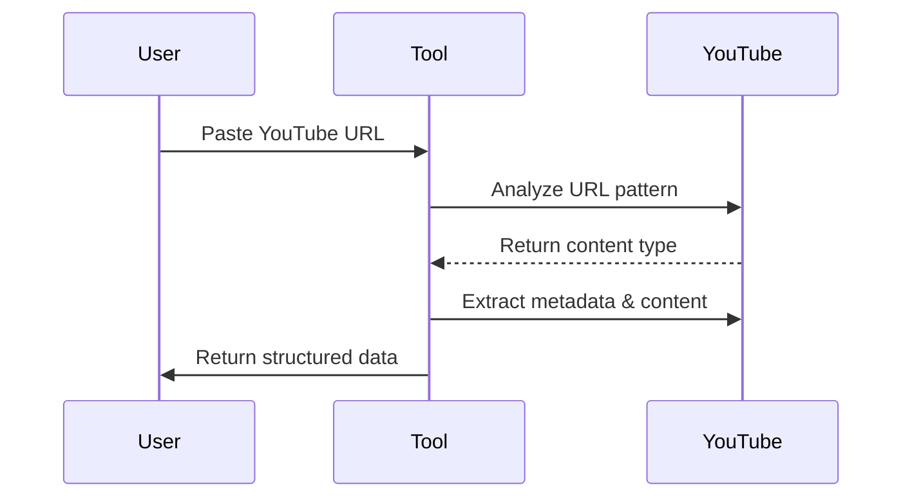

# 🎬 YouTube Scraper Pro
[YouTube Scraper Pro](https://apify.com/dz_omar/youtube-transcript-pro) extracts comprehensive data from ALL YouTube content: Videos, Shorts, Live streams, Podcasts, Courses, and full Channels. Process playlists and batch requests with ease. Proxy required. Perfect for researchers, marketers, and content creators.

## 🚀 The Intelligent Way to Extract YouTube Content

**Extract rich metadata, video information, and transcripts in seconds** - our advanced tool automatically detects and processes any YouTube URL type. Simply paste a link and get perfectly structured results.


## ✨ What Makes This Tool Unique

Unlike other YouTube data extractors on the platform, our tool offers:

- **Automatic content type detection** - Intelligently identifies videos, shorts, playlists, channels, courses, and live streams
- **URL pattern recognition** - Understands what you want based on the URL structure
- **Configurable processing speed** - Adjust parameters to optimize performance
- **Comprehensive metadata** - Get views, publication dates, descriptions, thumbnails, and more
- **Multi-language support** - Works with all languages available on YouTube
- **Transcript extraction** - When available, get complete transcripts with timestamps

## 🎯 Key Features

| Feature | Benefit |
|---------|---------|
| 🧠 **Smart URL Detection** | Automatically identifies the content type from URL patterns |
| ⚙️ **Adjustable Performance** | Configure processing speed to match your needs |
| 🌐 **Universal Compatibility** | Works with videos, shorts, playlists, channels, courses, live streams |
| 📊 **Rich Metadata** | Captures comprehensive video information |
| 🔍 **Precision Extraction** | Accurately retrieves video data and optional transcripts |
| 🛡️ **Reliable Performance** | Built-in retry mechanisms and configurable delay settings |

## 🔍 How It Works (3 Simple Steps)

1. **Paste** any YouTube URL (channel, playlist, video, etc.)
2. **Set** your preferences (optional)
3. **Get** perfectly structured data in JSON/CSV



## 🔧 Input Configuration

### Basic Usage
Simply provide one or more YouTube URLs:

```json
{
  "rawYouTubeUrls": [
    "https://www.youtube.com/@nesoacademy/shorts",
    "https://www.youtube.com/watch?v=qUdSpbimHDQ",
    "https://www.youtube.com/playlist?list=PLBlnK6fEyqRhoF3cPp0mgOZPuXeu84nAd"
  ],
  "maxResults": 50
}
```

### Advanced Configuration
Fine-tune the extraction process:

```json
{
  "rawYouTubeUrls": [
    "https://www.youtube.com/@nesoacademy/courses"
  ],
  "maxResults": 100,
  "MAX_RETRIES": 5,
  "BASE_DELAY_MS": 1000,
  "includeTimestamps": true,
  "proxyConfiguration": {
    "useApifyProxy": true,
    "apifyProxyGroups": ["RESIDENTIAL"]
  }
}
```

## 🧠 Smart URL Pattern Recognition

Our tool understands what you want based on URL patterns:

| URL Pattern | What It Extracts |
|-------------|------------------|
| `youtube.com/@channelname` | All videos from the channel |
| `youtube.com/@channelname/shorts` | Only shorts from the channel |
| `youtube.com/@channelname/courses` | Only course videos from the channel |
| `youtube.com/hashtag/hashtag` | videos from the hashtag |
| `youtube.com/hashtag/hashtag/shorts` | shorts from the hashtag |
| `youtube.com/watch?v=videoId` | Single video data |
| `youtube.com/watch?v=videoId&list=playlistId` | All videos in the playlist |
| `youtube.com/playlist?list=playlistId` | All videos in the playlist |
| `youtube.com/shorts/videoId` | Single short video data |

The tool also accepts channel handles as input and hashtags:
- `@channelname` - Processes the entire channel
- `@hashtag` - Processes the hashtag

## 📊 Output Format

Get comprehensive data for each video:

```json
{
  "VideoURL": "https://www.youtube.com/watch?v=qUdSpbimHDQ",
  "Video_title": "Time Complexity of Single Loops (Introduction)",
  "Channel_Id": "UCQYMhOMi_Cdj1CEAU-fv80A",
  "Description": "Algorithms: Time Complexity of Single Loops (Introduction)...",
  "Channel_Name": "Neso Academy",
  "Views": "10404 views",
  "Runtime": "7:50",
  "published_Date": "2024-08-22T06:30:28-07:00",
  "thumbnail": "https://i.ytimg.com/vi_webp/qUdSpbimHDQ/maxresdefault.webp",
  "transcript": {
    "content": "in our previous presentation we understood...",
    "language": "en",
    "segmentCount": 156
  },
  "timestamps": [
    {
      "sequence": 1,
      "start": "00:00:06,040",
      "end": "00:00:10,440",
      "duration": "00:00:04,400",
      "text": "in our previous presentations we"
    },
    ...
  ]
}
```

## ⚙️ Performance Optimization

Adjust these parameters for optimal performance:

- `MAX_RETRIES`: Number of retry attempts for failed requests (default: 3)
- `BASE_DELAY_MS`: Base delay duration between requests in milliseconds (default: 1000)
- `maxResults`: Maximum number of videos to process (default: 50)

## 🛠️ Advanced Use Cases

### Channel Analysis
Extract data from all videos on a channel to:
- Perform content analysis across videos
- Track video performance over time
- Generate keyword frequency reports
- Analyze posting patterns and engagement

### Educational Content
For courses and tutorials:
- Convert video lessons to searchable text via transcripts
- Create study guides from video content
- Archive educational content in structured format

### Content Repurposing
Transform video content into:
- Blog posts and articles
- Social media content
- Ebooks and guides

### Competitive Research
- Track competitor video performance
- Analyze topic trends across channels
- Identify high-performing content formats

## 🔍 Troubleshooting

| Issue | Solution |
|-------|----------|
| No transcript available | Many videos don't have captions enabled on YouTube |
| Rate limiting | Increase `BASE_DELAY_MS` to reduce request frequency |
| Processing too slow | Reduce `MAX_RETRIES` and optimize proxy configuration |
| Incomplete data | Check that the video is publicly accessible |
| Cookie management | For private or restricted videos, provide authentication cookies |

## 📈 Real-World Performance

- **Accuracy**: 99% data extraction accuracy for public videos
- **Success Rate**: 95% of videos successfully processed
- **Transcript Availability**: Depends on whether video creators enabled captions

## 🌟 Use Cases

- **Content Creators**: Research trends and repurpose video content
- **Researchers**: Analyze video content at scale
- **Educators**: Make video content searchable and accessible
- **Marketers**: Extract insights from competitor videos and channels
- **SEO Specialists**: Enhance content strategy with video data analysis
- **Journalists**: Research topics across YouTube channels

## 🔄 URL and Keyword Processing

Our tool uses an advanced URL and keyword parsing system that standardizes all YouTube content identifiers:

### Processing Capabilities
- Handles all YouTube URL formats (standard, shortened, mobile)
- Processes channel handles (`@channelname`)
- Supports hashtags (`#topic`)
- Recognizes content categories (Videos, Shorts, Live)

### Standardized Output Structure
All inputs produce a consistent object with these properties:
- `type`: Content type ('channel', 'video', 'playlist', 'hashtag')
- `id`: Unique identifier (channel ID, video ID, etc.)
- `category`: Content category when applicable
- `isKeyword`: Indicates if input was a keyword
- `url`: Properly formatted YouTube URL

### Examples

```
input: https://www.youtube.com/channel/UCD7yEscEXN6Y4XAMghyjyuw
output: type:channel, id:UCD7yEscEXN6Y4XAMghyjyuw, category:null, isKeyword:false, url: https://www.youtube.com/channel/UCD7yEscEXN6Y4XAMghyjyuw

input: https://www.youtube.com/@HamzaSalemTV/shorts
output: type:channel, id:@HamzaSalemTV, category:Shorts, isKeyword:false, url: https://www.youtube.com/@HamzaSalemTV/shorts

input: https://www.youtube.com/watch?v=aq8Czq2WrYU
output: type:video, id:aq8Czq2WrYU, category:video, isKeyword:false, url: https://www.youtube.com/watch?v=aq8Czq2WrYU

input: @HamzaSalemTV
output: type:channel, id:@HamzaSalemTV, category:null, isKeyword:true, url: https://www.youtube.com/@HamzaSalemTV/
```

### Special Cases Handled
- Channel URLs with various subcategories
- Video URLs in multiple formats
- Playlist URLs with or without video parameters
- International character handling
- Arabic text processing

This robust processing ensures reliable extraction across all YouTube content types.

## 🤝 Support & Contact

For assistance or custom implementations:

- Email: [fridaytechnolog@gmail.com](mailto:fridaytechnolog@gmail.com)
- GitHub: [https://github.com/DZ-ABDLHAKIM](https://github.com/DZ-ABDLHAKIM)
- Twitter: [https://x.com/DZ_45Omar](https://x.com/DZ_45Omar)
- Apify: [https://apify.com/dz_omar](https://apify.com/dz_omar)

---

## 📚 Quick Start Guide for Non-Technical Users

1. **Copy your YouTube URL**: Find the video, playlist, or channel you want to extract
2. **Paste it into the "rawYouTubeUrls" field**: Add it as a string in the array
3. **Set your maxResults**: Choose how many videos to process
4. **Click Start**: The tool will automatically detect what you need and process it
5. **Download Results**: Get your data in JSON, CSV, or other formats

No technical knowledge required - the tool automatically understands what you need!
